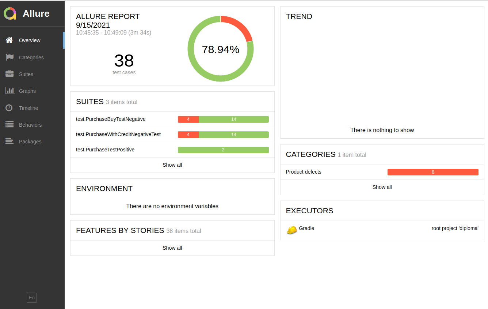

# Отчёт о проведен тестировании сервиса "Путешествие дня"

## Краткое описание
Было проведено автоматизирвоанное тестирование сервиса "Путешествие дня"

## Количество тест-кейсов
На основании Плана автоматизации было подготовлено окружение, собран проект и написано 36 тест-кейсов, из которых 28 прошли успешно, 8 завершились с ошибками. 
На основании проваленных тестов были созданы баг-репорты с достаточным описанием проблем. 

## % успешных/не успешных
По итогам тестирования 79% тестов были пройдены успешно, 21% были завершены с ошибками.

## Общие рекомендации
На основании этих данных рекомендуется передать данную информацию разработчикам для доработки проекта и после внесения доработок провести повторное тестирование. 
В систему автоматизации интегрированы отчеты Allure. 

